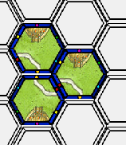
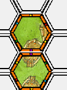

# Manual del usuario

- Para ejecutar el juego es necesario ejecutar el archivo interaccion.py
- La primera pieza es puesta al azar (es posible modificar esto descomentando la linea 70 y eligiendo una posicion específica entre las piezas)
- Se elige al Jugador 1 como el que siempre inicia y también se le asigna a él la primera pieza puesta (puede ser una ventaja como también una desventaja, en caso de que el Jugador 2 haga plot twist y le robe sus piezas :) )
- El juego funciona de acuerdo a las reglas específicadas (bordes correctos, no islas, etc.) pero con algunas especificaciones (modificaciones) a lo propuesto
	- Primero para el **Plot Twist**:
		- Como no estaba especificado en el enunciado, se consideró que 
			> El jugador que ponga la última pieza para unir tanto un camino como un río, se convierte en su dueño.
		  
		  Se refería a que un río o camino empezaba a ser entidad al estar unido a otro (es decir con mínimo 2 piezas) y por eso cada vez que un jugador conecta un río a otro del otro jugador, se hace plot twist y le roba la pieza (cambia el color). En una issue hace poco se explico que un río completo tenía ciertas especificaciones, pero no se alcanzó a cambiar por tiempo :/ y aparte en esta sección del enunciado no hacen mención a un "rio completo" sino que a una "unión".
		- Las ciudades sí cumplen con la condición de esperar a que se complete para que todas las piezas cambien de color.
	- Se puede retroceder la jugada, pero hay que tener ojo con el plot twist, ya que si tu última ficha cambió de color, ya no puedes revertir esa pieza, sino que reviertes la jugada de la pieza que pusiste antes a esa (la que cambió de color ya no te pertenece)
	- Para el **Término del Juego**, en caso de snitch o de completar el tablero, se termina automáticamente. Para el caso de no poder poner la pieza, se espera que el jugador intente más de 6 veces (orientaciones) y luego se le imprime un mensaje diciendo que podría ser que no se pueda seguir jugando, entonces él debe presionar Terminar Juego. Esto se decidió así por un tema de eficiencia, ya que la otra opción era considerar todas las opciones posibles y revisar el tablero (para cada orientación) en cada jugada y eso tardaba mucho tiempo.
- Se puede guardar el juego las veces que se quiera y volver a ese estado

# Sobre los puntajes

- Se asumió que durante el juego los jugadores no saben su puntaje (eso se entendió del enunciado) y que este se ve solo al apretar **Terminar Juego**.
- Como no estaba específicado y para hacer el juego más complejo, se decidió que las ciudades podían existir desde una pieza, pero que para estar cerrada el mínimo de piezas tenía que ser 2, cosa de preocuparse de tener las murallas en ambas piezas. Por lo tanto no se pueden crear ciudades "cerradas" con una sola pieza.
- Además, el cálculo de puntaje para la unión por un camino de 2 ciudades completas es similar al de 2 ciudades al menos una incompleta, ya que no estaba especificado.
- El cambio más grande en relación a lo estipulado es el siguiente:
	- Cuando 2 jugadores usan sus piezas para generar una misma ciudad, la ciudad que se va formando mientras no esté completa pertenece solo a uno de los jugadores y es al que puso la primera pieza de la ciudad. Ejemplo:
	

	En este caso todas las piezas de ciudad "pertenecen" al Jugador 1 naranjo ya que él puso la primera pieza y hay que considerar eso para el puntaje también. Serían 40 puntos por una ciudad incompleta de 4 piezas para el Jugador 1 y 0 para el Jugador 2. La única forma de que el Jugador 2 recupere su pieza es haciendo plot twist al completar la ciudad:
	

	- La razón para hacer esto es limitar a que los jugadores se "arriesguen" al intentar robarle una ciudad al otro, ya que mientras no la completen, todas las piezas que añadan o junten con esta ciudad, pasarán al puntaje del otro jugador. Aparte coincidía con la forma de modelar el problema, ya que la entidad debía tener esta conexión hacia "atrás" para después ir cambiando los colores :)
- Además, para el caso de tener más de 2 ciudades conectadas, no estaba muy claro si los 40xn puntos se sumaban a los puntos de tener 2 ciudades conectadas o no. Por lo tanto se definió que al tener más de 2 ciudades conectadas solo se entregn los 40xn puntos, ya que sino sería demasiado puntaje sumado (hace el juego más justo). Ejemplo:

Esa combinación solo entregará los 40x3 puntos al Jugador 2, y no los puntos por tener 2 ciudades conectadas, ya que si uno se fija hay 3 combinaciones posibles de 2 ciudades conectadas lo que sumaría muchos puntos usando el mismo camino. Si existiera la regla de grilla, esta se añadiría también a estos 40*3 puntos.
- No estaba tan claro en el enunciado si era necesario añadir los puntos de ciudades unidas por river cuando el jugador lograba la snitch dorada, ya que de igual forma el jugador ganará, por lo que estos no se añadieron.
- A veces se refieren a conectar un rio o camino con "una ciudad" sin especificar si es completa o no, en esta tarea se consideró que no tenia que ser completa para que le dieran los puntos de borde u otro no especificado.
- El resto funciona tal cual a lo que dice el enunciado.

# Otros

- En las issues habían distintas opiniones sobre el tema pero en esta tarea se consideró que las piezas que visualmente se veían como 2 ciudades separadas, lo eran.
Ejemplo:

Lo anterior si se considera como una ciudad cerrada y 2 abiertas, ya que en ambas piezas hay 2 ciudades separadas y al juntarlas se crea la ciudad completa.
- Se asume que no pedirán un hint más de 1 vez por turno (sería mucha ayuda) y además la pieza tiene que estar en la orientación deseada, el hint no va a rotar la pieza.

# Sobre las EDD implementadas

- ListaLigada():
	- Va a simular lo que hace una lista. Para hacerla se hacen nodos que guarden un valor y al nodo siguiente
	- Va a contener los metodos getitem, setitem, delitem para poder mutar la lista y obtener sus valores
	- Va a ser iterable gracias a __iter__ y __self__
	- Se va a poder crear entregandole una secuencia de elementos. Para eso se usa *args en __init__
	- Esta estructura se usa para distintas partes de la tarea, como guardar datos ordenados para el historial, piezas de los jugadores, movimientos de los jugadores, piezas disponibles, entidades creadas en el juego, etc.

- Diccionario():
	- Simula el comportamiento de un diccionario. Se hacen nodos con atributo key, valor y nodo siguiente
	- Se puede acceder a sus elementos utilizando la key adecuada (no la posicion como en la ListaLigada)
	- Es iterable para recorrer sus elementos
	- Se puede acceder a una lista de keys, a una lista de values y a una lista de items llamando a la función correspondiente
	- Con esta EDD se modela el tablero, haciendo que key = posicion, value = Pieza. Así puedo acceder a las piezas del tablero dependiendo de la posición y si no hay alguna pieza el value será igual a None. Se puede recorrer al ser iterable y para ver los 6 vecinos de cada pieza se usa el método vecinos(i, j) al cual se le entrega alguna posición del tablero y retorna 6 otras posiciones para usar como key en el diccionario del tablero
	- Se va a usar en la tarea para relacionar los bordes con sus segmentos. También para ver la cantidad de piezas de un tipo que hay. También para guardar la info de algún usuario se podría usar, como la cantidad de ciudades, caminos, etc.

- Tuplas():
	- Simula el comportamiento de las tuplas. Se usan los mismo nodos de lista ligada
	- Esta estructura no es mutable, por lo que si bien se puede acceder a sus elementos, no se pueden modificar
	- Se va a implementar principalmente para las posiciones dentro del tablero ya que serán tuplas (posiciónx, posicióny) y cada posición dentro del tablero no cambiará
	- Es iterable con __iter__ y __next__
	- Se va a poder crear entregandole una secuencia de elementos. Para eso se usa *args en __init__
	- También se usa para guardar los jugadores que son solamente 2 y siempre los mismos.

- Sets():
	- Simula el comportamiento de los sets, en la función de que no se pueden agregar elementos repetidos.
	- A medida que se iba avanzando en el programa, era posible perderse en el código y agregar por ejemplo una misma entidad 2 veces a una EDD, entonces para evitar problemas y errores con esto se implementó Sets, cosa de que si intentábamos agregar 2 veces el mismo objeto a la EDD, no pasara nada. 

